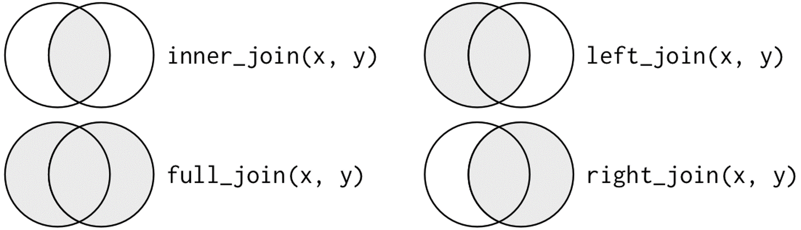

# 실습환경 정의하기
```{r "setup", include = FALSE}
knitr::opts_knit$set(root.dir = "C:/BA2021/")
```

# 패키지 불러오기
```{r}
library(dplyr) 
library(tidyr) 
library(readr) 
```

---

# 1. 데이터 구조 변환 : `tidyr`

```{r, out.width = "300px", include = FALSE}
knitr::include_graphics("./long_wide_transformation.png")
```

R에서 분석 목적에 맞게 데이터를 정리함으로써 타이디(*깔끔한* 정도로 이해하면 쉽다.) 데이터(tidy data)로 준비해야 한다.
`타이디 하다`는 의미는 무엇일까?

대부분의 R 함수는 벡터(Vector) 연산을 한다. 
따라서, 행과 열을 지니는 데이터의 각 행(Column)은 하나의 관측치(Observation)을 나타내고 각각의 열(Column)은 관측치의 속성(Feature)을 나타내야 한다. 

아래 데이터를 살펴보자.

```{r}
nyaq_1 <- read_csv("./data/nyaq_1.csv")
nyaq_2 <- read_csv("./data/nyaq_2.csv")
nyaq_3 <- read_csv("./data/nyaq_3.csv")
nyaq_4 <- read_csv("./data/nyaq_4.csv")
```

따라서, 위 데이터에서 `nyaq_4` 만이 tidy 하다고 할 수 있다.


## 1-1. `gather`
`gather` 함수는 Wide shape 데이터를 Long shape으로 변환할 때 사용하는 함수로 속성으로 들어갈 칼럼명을 나열하고, 
해당 속성들을 나타내는 변수명을 `key`에 정의 그리고 각각의 속성이 나타내는 value를 표현할 변수명을 `value`에 정의한다. 
```{r}
library(tidyr)
```

```{r}
long_aq <- gather(nyaq_4, "Temp", "Wind", "Ozone", "Solar.R", key = "variable", value = "value")

long_aq <- 
  nyaq_4 %>%
  gather("Temp", "Wind", "Ozone", "Solar.R", key = "variable", value = "value") %>%
  arrange(Month, Day)
```

## 1-2. `spread`

```{r}
wide_aq <- 
  long_aq %>%
  spread(key = variable, value = value)
```

---

# 2. 복수의 데이터 다루기

```{r, out.width = "300px", include = FALSE}

```


```{r}
x <- read_csv("key, value_1, value_2
              1, 33.2, 48.5
              2, 49.3, 59.1
              3, 54.0, 24.4")

y <- read_csv("key, value_3, value_4
              2, 13.2, 22.5
              3, 9.3, 11.1
              4, 13.0, 4.4
              5, 8.7, 11.5")

```

## 2-1. `dplyr` 의 `join`함수


### 2-1-1. Inner join
```{r}
z <- inner_join(x,y, by = "key")
```

### 2-1-2. left join
```{r}
z <- left_join(x,y, by = "key")
```

### 2-1-3. right join
```{r}
z <- right_join(x,y, by = "key")
```

### 2-1-4. full join
```{r}
z <- full_join(x,y, by = "key")
```


### 2-1-5. key가 중복된 경우

```{r}
x <- read_csv("key, value_1, value_2
              1, 33.2, 48.5
              2, 49.3, 59.1
              2, 49.8, 58.1
              3, 54.0, 24.4")

y <- read_csv("key, value_3, value_4
              2, 13.2, 22.5
              3, 9.3, 11.1
              3, 13.3, 12.2
              4, 13.0, 4.4
              5, 8.7, 11.5")

```

두 테이블 모두 중복키를 가지고 있는데, 이럴 경우, 중복키로 조인하면 가능한 모든 조합을 산출해준다.
```{r}
z <- inner_join(x,y, by = "key")
z <- left_join(x,y, by = "key")
z <- right_join(x,y, by = "key")
z <- full_join(x,y, by = "key")
```